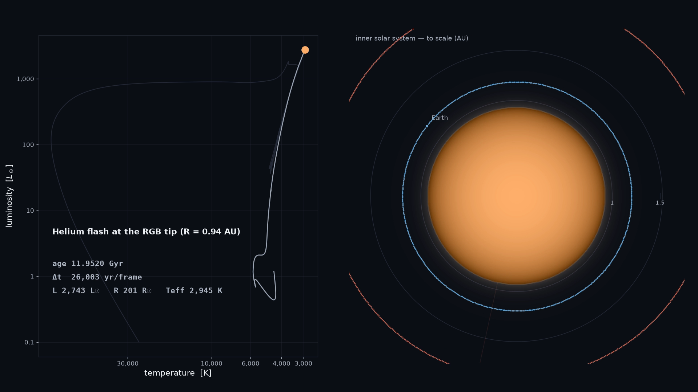

# The Future of the Sun and the Fate of the Earth

A calibrated, end-to-end computation of the Sun's evolution from the present day
through the red-giant branch, helium flash, asymptotic giant branch, and into the
white-dwarf era — coupled to an *N*-body integration of the surviving planets under
solar mass loss and tidal drag. The result is, to our knowledge, the most complete
current picture of what actually happens to the Earth.

[](media/sun_future.mp4)

*Click the poster to play `media/sun_future.mp4`. Left: the Sun on the
Hertzsprung–Russell diagram, colored by temperature, with milestone captions.
Right: the inner solar system to scale, with live osculating orbits from the
N-body run. It is built to be **scrubbed** back and forth during a talk — see
[Presenting the animation](#presenting-the-animation).*

---

## Headline results

The Sun is calibrated to reproduce today's luminosity, radius, temperature, surface
composition, and helioseismic constraints (present-day match: L = 0.997 L☉,
R = 1.000 R☉, T_eff = 5767 K). Evolving that model forward:

| Epoch (from today) | Event |
|---|---|
| **+0.8 Gyr** | Solar output +6%; CO₂ drawdown ends C3 photosynthesis — Earth's biosphere in decline |
| **+1.15 Gyr** | Moist-greenhouse threshold (+10% L): the oceans begin to evaporate |
| **+3.7 Gyr** | Runaway greenhouse (+40% L): Earth becomes Venus-like |
| **+4.43 Gyr** | Core hydrogen exhausted — the Sun leaves the main sequence |
| **+7.380 Gyr** | **Mercury** engulfed |
| **+7.384 Gyr** | **Venus** engulfed |
| **+7.385 Gyr** | **RGB tip / helium flash**: R = 202 R☉ = 0.94 AU, L = 2760 L☉. Mass = 0.76 M☉ (24% already lost to winds). **Earth survives**, its orbit expanded to ~1.25 AU |
| **+7.5 Gyr** | Post-tip resonance sweeping destabilizes **Earth and Mars**; Mars is ejected, Earth left on an eccentric orbit (a ≈ 1.67 AU, e ≈ 0.17) |
| **+7.53 Gyr** | A **0.53 M☉ carbon–oxygen white dwarf** is born; Earth and the giant planets orbit the cooling ember |

**The new result** is the last two rows. Because tidal drag suppresses Earth's
orbital expansion near the RGB tip while Mars expands adiabatically with the full
mass loss, the Earth–Mars period ratio sweeps through the 7:3 and 9:4 mean-motion
resonances. This pumps their eccentricities until the orbits cross — a
*tidally-differential* destabilization channel that is absent from both the
classic single-planet engulfment calculations (which ignore the surviving
multi-planet dynamics) and the classic post-main-sequence *N*-body studies (which
use uniform mass loss and no tides). The instability is reproduced independently by
WHFast and by the encounter-capable MERCURIUS integrator.

**Caveats (read before citing):** the Earth–Mars outcome is a *single chaotic
realization*; the branching ratio between "Mars ejected / Earth eccentric,"
"mutual collision," and "long-lived resonant chain" requires an ensemble. The tidal
model damps semi-major axis but not eccentricity, and the final ~30 Myr of the
N-body run relies on extrapolating the stellar track slightly past the end of the
MESA data. These are exactly the things a follow-up paper should nail down.

---

## What's in this repository

```
mesa_env.sh              environment setup for MESA + the MESA SDK
sun_to_wd/               uncalibrated 1 Msun test case (inlists + run scripts)
sun_to_wd_calib/         CALIBRATED run: inlist_calibrated + phase headers
analyze_sun.py           stitch the six phase histories; key epochs + HR figure
animate_sun.py           the two-panel HR + solar-system animation
solar_system_future/
  secular_tides.py       secular ODE: wind + Zahn convective tide (fast baseline)
  rebound_driver.py      the "hero" N-body run (REBOUND + REBOUNDx)
  hero_tail.py           MERCURIUS re-integration of the close-encounter tail
  orbit_cloud.py         osculating-orbit point clouds for the animation
  crosscheck.py          secular-vs-N-body validation near the RGB tip
  bench_whfast.py        WHFast timing benchmark
paper/ms.tex             the ApJ-style manuscript
media/                   sun_future.mp4 + poster frame
requirements.txt         Python dependencies
```

Regenerable bulk outputs (MESA `LOGS_*`, `*.mod`, N-body `*.bin`, high-bitrate
`*.mov`) are git-ignored; the workflow below reproduces them from scratch.

---

## Reproducing the work

### 1. Install MESA

Install the [MESA SDK](http://user.astro.wisc.edu/~townsend/static.php?ref=mesasdk)
and [MESA r26.04.1](https://zenodo.org/records/19722306). Edit the paths in
`mesa_env.sh`, then:

```sh
source mesa_env.sh          # sets MESA_DIR, MESASDK_ROOT, compilers
```

> **macOS (Tahoe / 26.x) note.** Two fixes were needed on Apple Silicon in 2026:
> (1) the SDK's stale `lib/gcc/.../include-fixed/{stdio.h,math.h}` shadow the Xcode
> SDK and must be moved aside; (2) without XQuartz, set `USE_PGSTAR = NO` and
> `LOAD_PGPLOT = -lz` in `$MESA_DIR/utils/makefile_header` before `./install`.

### 2. Calibrate the solar model

We use MESA's shipped `star/test_suite/simplex_solar_calibration` case, which tunes
(Y, [Fe/H], α_MLT, f_ov) to match L, R, surface Z/X, surface He, the convection-zone
depth, and the helioseismic sound-speed profile at 4.61 Gyr. Our best fit
(χ² = 3.54): Y₀ = 0.2772, Z₀ = 0.0203 ([Fe/H] = +0.10), α_MLT = 1.945,
f_ov = 0.0314. These values are hard-wired in `sun_to_wd_calib/inlist_calibrated`.

### 3. Evolve the Sun to a white dwarf

```sh
cd sun_to_wd_calib
./mk && ./rn_solar          # ~4-7 h; pre-MS -> WD, dense per-step history
cd .. && ./.venv/bin/python analyze_sun.py    # key epochs + sun_evolution.png
```

### 4. Integrate the planets

```sh
python -m venv .venv && ./.venv/bin/pip install -r requirements.txt
cd solar_system_future
../.venv/bin/python crosscheck.py             # validate the tide (secular vs N-body)
../.venv/bin/python rebound_driver.py \
    --run-dir ../sun_to_wd_calib --t0 10.75e9 --t1 12.4e9 --archive hero.bin
../.venv/bin/python hero_tail.py              # MERCURIUS close-encounter tail
```

### 5. Render the animation

```sh
SUN_RUN=$PWD/sun_to_wd_calib \
NBODY_ARCHIVE="$PWD/solar_system_future/hero.bin;$PWD/solar_system_future/hero_tail.bin" \
NBODY_T0=10.75e9 \
./.venv/bin/python animate_sun.py             # -> sun_future_v1.mp4
```

---

## Presenting the animation

The evolution is wildly non-linear in time, so a straight-through playthrough is a
poor teaching tool — the film is designed to be **scrubbed**. For frame-accurate
scrubbing, encode an all-intra copy (every frame a keyframe):

```sh
# small, all-intra H.264 (recommended for Keynote)
ffmpeg -i media/sun_future.mp4 -c:v libx264 -crf 16 -g 1 -keyint_min 1 \
       -sc_threshold 0 -pix_fmt yuv420p -movflags +faststart sun_future_intra.mov
# ProRes master (best for QuickTime; large)
ffmpeg -i media/sun_future.mp4 -c:v prores_ks -profile:v 3 -pix_fmt yuv422p10le \
       sun_future_scrub.mov
```

In **Keynote**: insert the all-intra `.mov`, set *Start Movie: On Click*, and hover
to drag the timeline. In **QuickTime** (best jog control): full-screen the `.mov`
and step frame-by-frame with the ←/→ arrow keys.

---

## Software

MESA r26.04.1 (Paxton et al.); MESA SDK 26.6.1; REBOUND 4.6 + REBOUNDx 4.6 (Rein
et al.). See `paper/ms.tex` for full references and methodology.

## License

MIT (code). The MESA and REBOUND inputs are covered by their respective licenses.
